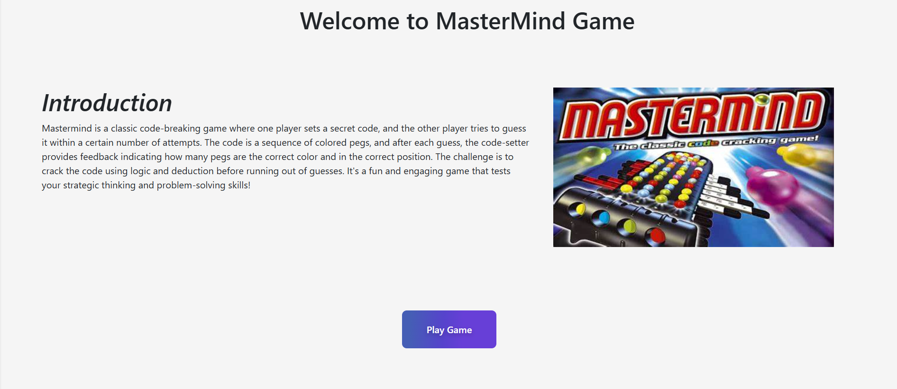

# Mastermind Game



## Overview

Welcome to the **Mastermind Game**! This is a classic code-breaking game built using JavaScript. Challenge yourself to guess the secret code in as few attempts as possible.

## Features

- **Interactive Gameplay**: Engaging user interface with smooth interactions.
- **Customizable Difficulty**: Choose from different levels of difficulty.
- **Hint System**: Get hints to help you crack the code.
- **Responsive Design**: Play on any device, whether it's a desktop, tablet, or mobile.

## Installation

To run the Mastermind Game locally, follow these steps:

1. **Clone the Repository**:
    ```sh
    git clone https://github.com/iMamoonAkhter/Mastermind_Game_JS.git
    ```

2. **Navigate to the Project Directory**:
    ```sh
    cd Mastermind_Game_JS
    ```

3. **Open the `index.html` File**:
    Open `index.html` in your preferred web browser.

## How to Play

1. **Objective**: Guess the secret code within the allowed number of attempts.
2. **Code Setup**: The code consists of a series of colors, and the number of colors depends on the chosen difficulty level.
3. **Making a Guess**: Select the colors you think are in the code and submit your guess.
4. **Feedback**: After each guess, you will receive feedback:
    - **Black Pegs**: Correct color in the correct position.
    - **White Pegs**: Correct color in the wrong position.
5. **Win Condition**: Crack the code by placing all the colors in the correct positions before running out of attempts.

## Contributing

Contributions are welcome! To contribute to this project:

1. Fork the repository.
2. Create a new branch (`git checkout -b feature-branch`).
3. Make your changes and commit them (`git commit -m 'Add some feature'`).
4. Push to the branch (`git push origin feature-branch`).
5. Open a pull request.

## License

This project is licensed under the MIT License. See the [LICENSE](LICENSE) file for details.

## Contact

If you have any questions or feedback, feel free to reach out:

- **GitHub**: [iMamoonAkhter](https://github.com/iMamoonAkhter)

## Demo

Check out the live demo of the game [here](https://github.com/iMamoonAkhter/Mastermind_Game_JS).

---

Thank you for checking out the Mastermind Game! Enjoy breaking the code! 🎉
